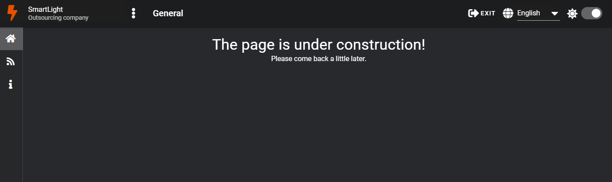

Module NinjaClient from NinjaProject
=============================

### Description
___

One of the main 2 modules: responsible for the client side of the application.

### Start-up instructions
___

1. First you need to download and install all dependencies with the _**“npm install”**_ command.
2. After the dependencies are fully downloaded and installed, you can run the client module.
To do this, run the _**“npm run serve”**_ command at the root of the module.
3. Go to the browser at: **[http://localhost:3000/](http://localhost:3000/)**.

### Includes functionality
___

- Email && Password authorization.
- Authorization via google;
- Registration with email confirmation via verification token (it is possible to re-request verification token);
- Customizing the application: language, dark/light theme and show/hide full sidebar;
- Jump across multiple pages.

### Technology stack
___

- Vue2 (followed by switching to Vue3);
- Vuex storage;
- Routing via Vue Router;
- Client interface using components and layout via Vuetify2 (followed by switching to Vuetify3);
- Localization via Vue i18n;
- Working with the server via Axios;
- Launching the application via Vue Cli.

